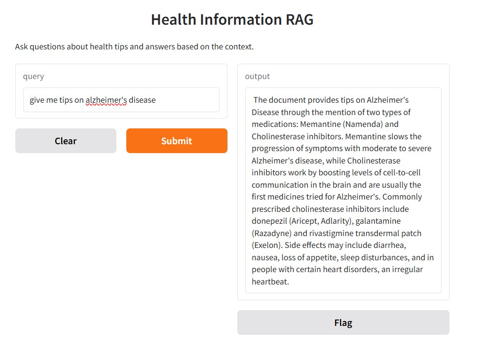

# HealthInformation_RAG

This RAG aims to enhance wellness tips based on certain known diseases that an individual may have.



## Documents
- Currently using MayoClinic for data collection of disease and a specified tip. 

## Running the App
Just run ```python3 rag_main.py``` This is the received when prompted questions about certain disease treatments.
